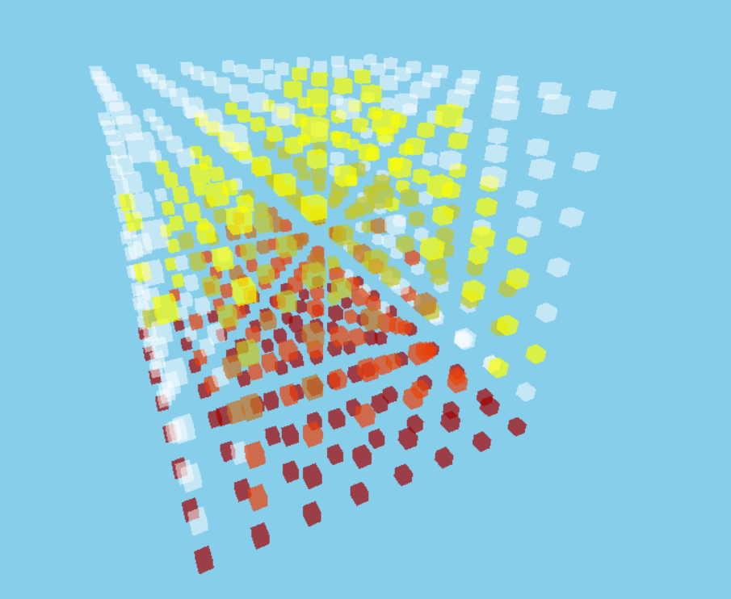
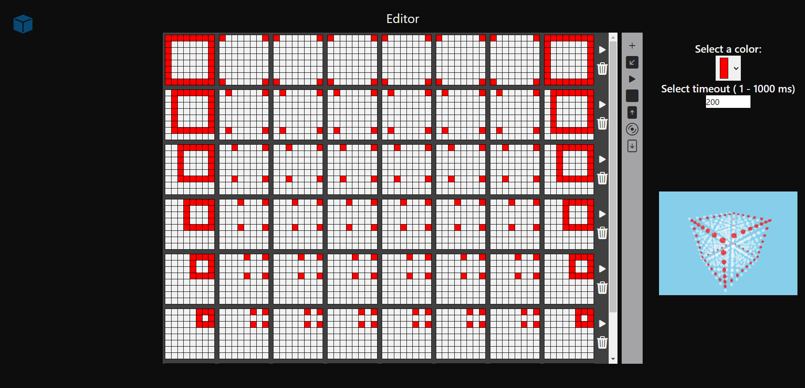
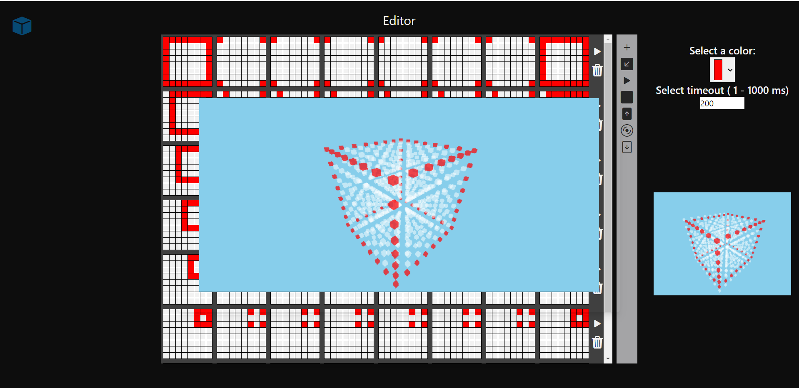
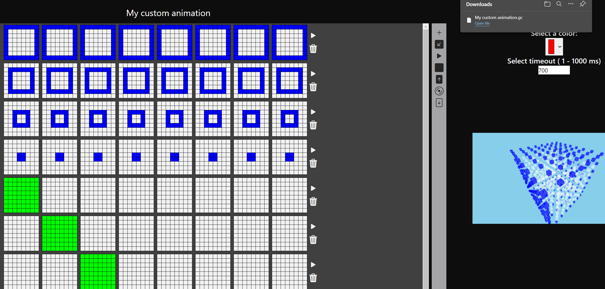
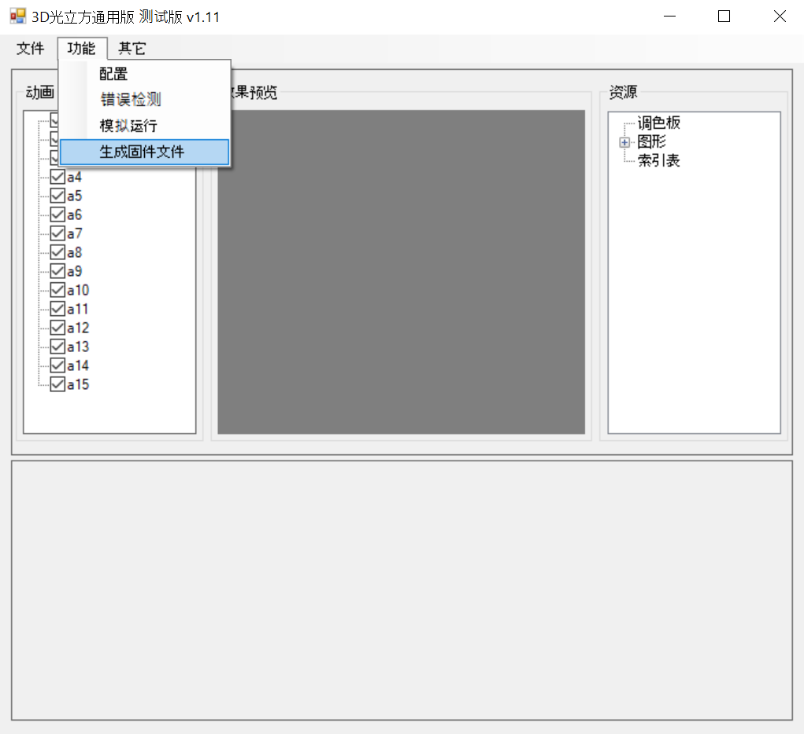
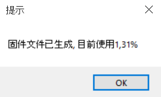
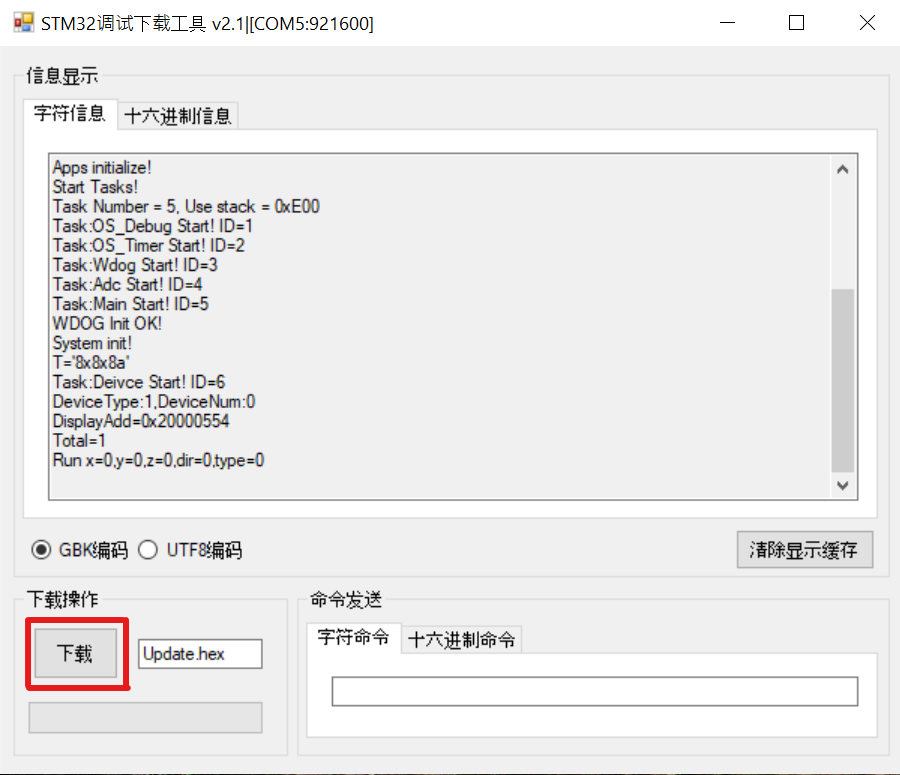
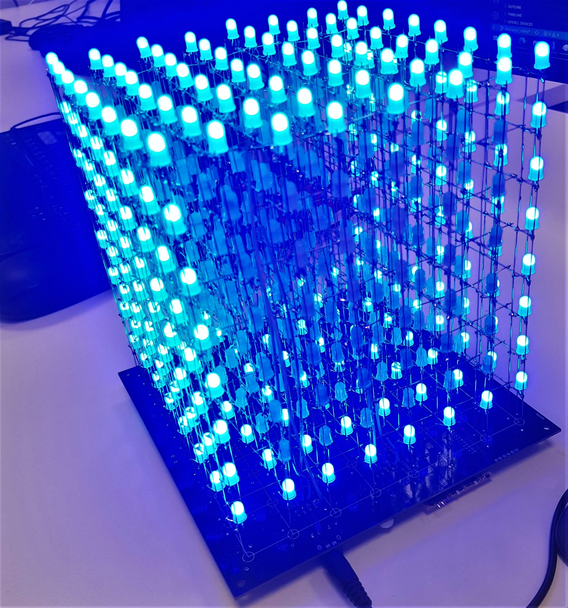

# LED Cube
## Setup
1) Install node.js:<br />
    On Windows: https://nodejs.org/en/ <br />
    On linux:
        ```
        sudo apt install nodejs
        ```
        , ``` 
        sudo apt install npm
        ```
2) setup dependencies
    ```
    npm install
    ```
3) run
    ```
    npm start
    ```
4) Go to http://localhost:1234
## Software
The software generates two files. The file with .lcaf extension contains a 4D array that represents the 3D cube animation frames in time.
It is possible to create new animations using the editor or upload animation files (with .lcaf extension) and view them in the home page.
When an animation is created, it is saved in the local storage and will remain there until the user clears the application data.

To upload the animation to the iCubeSmart 8x8x8 rgb cube the user has to download the file with .gc extension. The software automatically generates the .gc file that is in binary format and can be uploaded to the compiler.



## Editor
All the tools for the editor are located on the right side of the editing panel.
* ➕ icon allows the user to add new frames to the animation.
* ↙️ icon allows the user to view the animation in the development stage.
* ▶️ icon allows the user to start the animation.
* 🟦   icon allows the user to stop the animation.
* ⬆️ icon allows the user to upload animation file.
* 💿    icon allows the user to download a".lcaf" animation file.
* ⬇️ icon allows the user to download a".gc" animation file.
* 🗑️ icon allows the user to delete a specific frame
* ▶️ icon allows the user to see a specific frame animation.
* The duration of a single frame is set on the right side of the editor in the ```Select timeout``` section.
* Color can be chosen in the ```Select a clolor``` section.
* Cells of the cube can be colored by using the left button of the mouse.
* Cells can be deleted by pressing the right button of the mouse.

#### Note:
The user can add up to 15 frames per animation.
When the limit is exceeded, the user will be notified by a message and won't be able to add any more frames.




## After creating an animation
After creating an animation user must export it as .gc file. This can be done with last button in controls section:



After saving .gc file, user must compile animation using ./Chinese software/RGB_3D_software.exe. To load .gc file, drag it into the RGB_3D_software window and pressing the button seen in the picture:


After pressing the button a new window will appear letting user know how much of microcontroller's memory is occupied:


Now an update.hex file has been generated at ./Chinese software. Assuming LED Cube is connected to computer properly, user can upload the code with ./Chinese software/Download_Tool.exe by pressing the button marked in picture:


When the program is done, LED cube will automatically restart and display the new animation.
