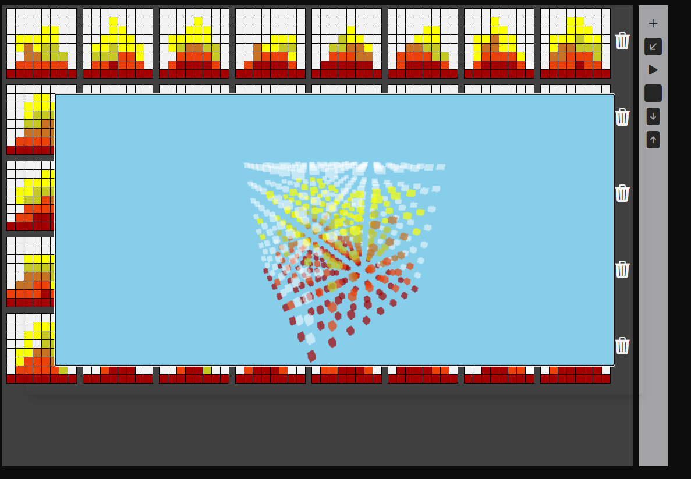

# Cube
### Setup
1) Install node.js:<br />
    On Windows: https://nodejs.org/en/ <br />
    On linux:
        ```
        sudo apt install nodejs
        ```
        , ``` 
        sudo apt install npm
        ```
2) setup dependencies
    ```
    npm install
    ```
3) run
    ```
    npm start
    ```
4) Go to http://localhost:1234
### Software
The software generates a file that contains a 4D array that represents the 3D cube animation frames in time.
It is possible to create new animations using the editor or upload animation files and view them in the home page.
When an animation is created, it is saved in the local storage and will remain there until the user clears the application data.


### Editor
All the tools for the editor are located on the right side of the editing panel.
* ➕ icon allows the user to add new frames to the animation.
* ↙️ icon allows the user to view the animation in the development stage.
* ▶️ icon allows the user to start the animation.
* 🟦 icon allows the user to stop the animation.
* ⬇️ icon allows the user to download the created animation file.
* ⬆️ icon allows the user to upload animation file.
* 🗑️ icon allows the user to delete a specific frame
* The duration of a single frame is set on the right side of the editor in the ```Select timeout``` section.
* Color can be chosen in the ```Select a clolor``` section.


